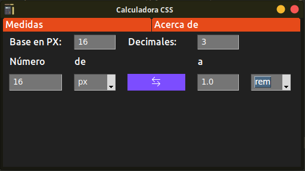

# calCss
Calcule con facilidad sus unidades CSS

## Unidades Soportadas
* PX
* REM
* EM
* %
* IN
* PC(Computer)
* PT(Computer)
* VW
* VH
* CM
* MM
* line-height
Todas esta unidades se pueden convertir entre ellas mismas

> Hecha en Python, pensada en los desarrolladores frontEnd

Licencia [MIT](LICENSE)